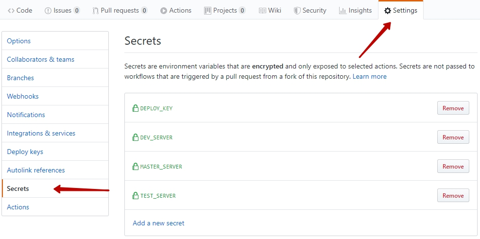

# Deploy via Github Actions and Deployer

The repository contains <a href="https://deployer.org">Deployer</a> configuration for Magento2 and example of <a href="https://help.github.com/en/github/automating-your-workflow-with-github-actions">Github Actions</a> workflow. The workflow creates events on push into dev/test/master branches and initiate a deployment process to dev/test/master servers, correspondingly.

You need to follow this simple steps to integrate in your project:

1. Copy _deploy.yml_ from the repo to _.github/workflow_ folder

2. Create required secrets in your repository:
* DEPLOY_KEY: private key for connection to dev/test/master server
* DEV_SERVER: dev server, should be in form _user@server:port_
* TEST_SERVER: test server, should be in form _user@server:port_
* MASTER_SERVER: production server, should be in form _user@server:port_

3. Prepare shared folder on your servers:
* copy _app/etc/env.php_ from current document root to _~/deploy/shared/app/etc/env.php_
* copy all media files from _pub/media_ to _~/deploy/shared/pub/media_

4. Be sure all deployment steps are going right on servers (take care about composer/ssh keys)

5. Push a commit to dev/test/master branch!

## Related links:

https://deployer.org

https://help.github.com/en/github/automating-your-workflow-with-github-actions
